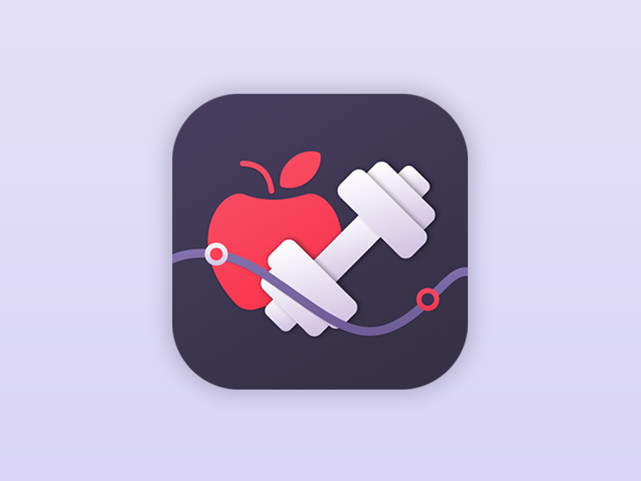

<a name="readme-top"></a>

<!--
HOW TO USE:
This is an example of how you may give instructions on setting up your project locally.

Modify this file to match your project and remove sections that don't apply.

REQUIRED SECTIONS:
- Table of Contents
- About the Project
  - Built With
  - Live Demo
- Getting Started
- Authors
- Future Features
- Contributing
- Show your support
- Acknowledgements
- License

OPTIONAL SECTIONS:
- FAQ

After you're finished please remove all the comments and instructions!
-->

<div align="center">
  <!-- You are encouraged to replace this logo with your own! Otherwise you can also remove it. -->
  
  <br/>

  <h3><b>Table des matières</b></h3>

</div>

<!-- TABLE OF CONTENTS -->

# 📗 Table des matières

- [📖 A propos](#about-project)
  - [🛠 Produit avec](#built-with)
    - [:gear: Technologies](#tech-stack)
- [💻 Pour commencer](#getting-started)
  - [:palm_tree: Arborescence](#tree)
  - [:clipboard: Pré-requis](#setup)
  - [:inbox_tray: Téléchargement](#download)
  - [:runner: Exécution](#run)
- [👥 Auteurs](#authors)

<!-- PROJECT DESCRIPTION -->

# 📖 FitSyncPro <a name="about-project"></a>

> FitSyncPro est une application mobile interactive qui permet de faire du sport à tout moment de la journée.

## 🛠 Produit avec <a name="built-with"></a>

### :gear: Technologies <a name="tech-stack"></a>

Ce projet est fait avec beaucoup d'amour et un peu d'eau fraiche.

<p align="right">(<a href="#readme-top">back to top</a>)</p>

<!-- GETTING STARTED -->


## 💻 Pour commencer <a name="getting-started"></a>

### :palm_tree: Arborescence <a name="tree"></a>

```
 +- Compte_Rendu/      Dossier contenant le compte rendu
 |   +- Compte_rendu_groupe_4.pdf           
 +- hello_worlds/      Dossier de démonstration du dépôt
 +- icons/
 |   +- logo.png       Logo du projet
 +- img/
 |   +- arrows/
 |   |   +- arrow_down.png
 |   |   +- arrow_left.png
 |   |   +- arrow_right.png
 |   |   +- arrow_up.png
 |   +- exercice/
 |   |   +- ar_img.png
 |   |   +- crunch_classique.png
 |   |   +- pause.png
 |   |   +- play  .png
 +- js/
 |   +- exercice.js
 +- ressources/
 +- styles/
 |   +- exercice.css
 |   +- style_anas.css
 +- README.md
```


### :clipboard: Pré-requis <a name="setup"></a>

Assurer vous d'avoir un navigateur internet moderne et à jour.

### :inbox_tray: Téléchargement <a name="download"></a>

Cloner ce dépôt git dans un répertoire.

```
git clone https://git.enib.fr/m0cainjo/cai-web.git
```

### :runner: Exécution <a name="run"></a>

Pour lancer ce projet, il suffit de se rendre dans le dossier `src`.
```sh
cd src
```
Les commandes à éxécuter en fonction du navigateur :
<details>
  <summary>Firefox</summary>
  <code>
    firefox index.html
  </code> 
</details>


<p align="right">(<a href="#readme-top">back to top</a>)</p>

<!-- AUTHORS -->

## 👥 Auteurs <a name="authors"></a>

👤 **BEN DAHMANE Anas**

- GitLab: [@a2bendah](https://git.enib.fr/a2bendah)

👤 **BEN HASSOUNA Mounir**

- GitHub: [@m1benhas](https://git.enib.fr/m1benhas)

👤 **CAINJO REGEARD Mael**

- GitHub: [@m0cainjo](https://git.enib.fr/m0cainjo)

👤 **CREAC'H Mael**

- GitHub: [@m0creach](https://git.enib.fr/m0creach)


<p align="right">(<a href="#readme-top">back to top</a>)</p>